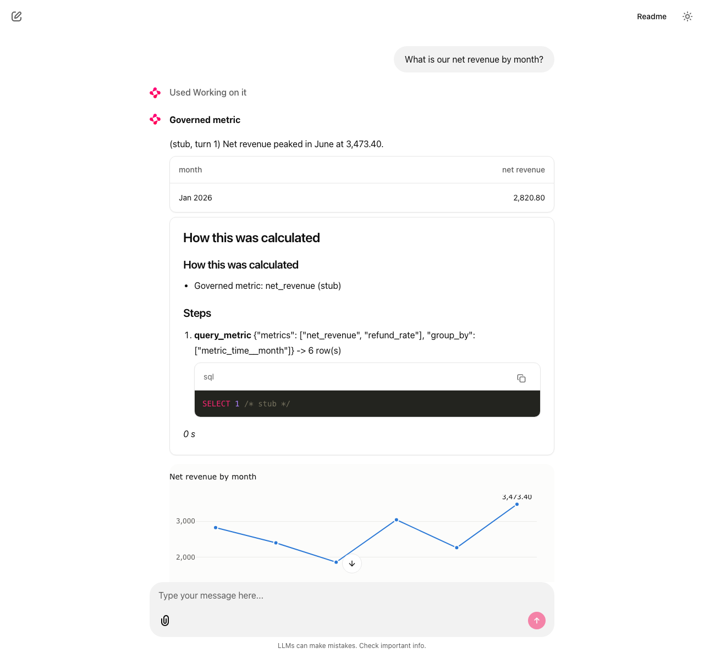

# Data Copilot

A self-hosted assistant for questions about a warehouse — Postgres, a local DuckDB file, or
Trino. It answers from governed metrics first and says so when it cannot.



```
question ─► Qwen3 (Ollama) ─► describe_metrics ─┐
                              query_metric ─────┼─► MetricFlow ─► dbt profile target ──┐
                              search_catalog ───┤   (dbt semantic layer)               │
                              run_sql ──────────┼─► sqlglot guard ─► datasources/ ──────┴─► Postgres | DuckDB | Trino
                              derive ───────────┘   (derive.py: change/share over an
                                                      already-returned result, no query)
```

Both arrows into the engine are the same switch: `COPILOT_DATASOURCE` (`postgres` | `duckdb` |
`trino`) picks a `datasources/` class for run_sql/catalog and, via `DBT_TARGET`, the matching
dbt profile target for the governed path — see **Data sources** below.

| Piece | Job | Open-source project |
|---|---|---|
| Metric definitions | "revenue" means one thing | dbt + MetricFlow (Apache 2.0) |
| Business rules | which statuses count as revenue, glossary, which columns are personal data | CSV/YAML in `dbt-test-project/` |
| Catalog | what tables, columns and metrics exist | dbt manifest + `information_schema` |
| Fallback SQL | questions no metric covers | sqlglot validation (multi-dialect), one read-only role/mode |
| Model | tool calling | Qwen3 via Ollama (swap `llm.py` for vLLM) |

What the code (not the model) guarantees on every answer:

- **Footer** "How this was calculated", built from the tool trace: governed metric
  or ad-hoc SQL, with the filters and the query.
- **Result tables** drawn from the returned rows, so a multi-row result is never
  retyped by the model.
- **Grounding check**: every figure in the model's text must appear in a tool
  result or be a sum, difference or share of returned figures. An invented figure
  triggers one automatic correction; if it persists the answer carries a warning.
- **Meaningless groupings are refused**: a ratio metric cannot be grouped or filtered by a dimension it is
  built from (`refund_rate` by status is always 0% or 100%). Derived from the measure expressions, so
  new metrics are covered automatically.
- **A change over time or a share of total is computed in code, not the model, for *any* result**:
  the `derive` tool (`derive.py`) takes the most recent query_metric/run_sql result already in the
  conversation and computes period-over-period change or share-of-total over it — no new metric
  has to be defined for "month on month" or "percentage of total" to work on a metric, a
  breakdown, or an ad-hoc SQL result nobody anticipated. Where a specific ratio *is* worth
  blessing as an exact, named number (`net_revenue_growth_mom`, `offset_window: 1 month` in
  dbt-test-project/models/marts/semantic_layer.yml), the model is told to prefer it; `derive` is
  what covers everything else, so a governed metric is never a prerequisite for "what changed" or
  "what share" to be answerable. The first period in a range has no prior period, and a boundary
  artifact of MetricFlow's time-spine join can add one spurious trailing period to an
  `offset_window` metric specifically; both come back honestly `null` and are trimmed from the
  table (`tables.py`), never shown as zero or invented.
- **"Not available" is explicit**: `describe_metrics` and `search_catalog` report words that match nothing in
  the warehouse, and `describe_metrics` searches the catalog itself when no metric matches.
- **Fast first**: thinking is off (~15 s). An answer that used ad-hoc SQL, ended on
  an error or still has unverified figures is re-run once with thinking on (~3 min).
- **Audit log** `logs/audit.jsonl`: question, tools, SQL, row counts. Never rows or
  answer text. `python audit.py recent`, and `python audit.py fallbacks` lists the
  questions that needed ad-hoc SQL: the backlog of metrics worth governing.
- **Personal data is masked, not just avoided by convention**: a column dbt's schema.yml marks
  `meta: {pii: true}` (in this project: customer name and email) comes back from every tool,
  governed or ad-hoc, as `[personal data hidden]`, with a note telling the model to refer to
  `customer_id` instead. Off with `COPILOT_MASK_PII=false`. See **Privacy** below for the gap.
- **Ad-hoc SQL can be switched off** (`COPILOT_ALLOW_RUN_SQL=false`): the tool disappears from
  what the model is offered, and the prompt itself says only governed metrics and catalog
  metadata are answerable. For a deployment where "the model might write a wrong query" is not
  an acceptable risk at all, not even behind sqlguard.

## Data sources

One engine at a time, chosen with `COPILOT_DATASOURCE` (default `postgres`); `DBT_TARGET`
follows it automatically so the governed path (MetricFlow, via the dbt profile target of the
same name in `dbt-test-project/profiles.yml`) and the ad-hoc path (`run_sql`, `search_catalog`,
via `datasources/`) always point at the same warehouse. Adding an engine means one class in
`datasources/` (`dialect`, `schema`, `query()`, `columns()`) plus one profiles.yml target.

| | Postgres | DuckDB | Trino |
|---|---|---|---|
| Status | measured (the golden set) | verified (dbt build + a real model run below) | verified (real cluster, below) |
| Set with | `COPILOT_DATASOURCE=postgres` (default) | `COPILOT_DATASOURCE=duckdb` | `COPILOT_DATASOURCE=trino` |
| Read-only guarantee | role + read-only session + sqlguard | sqlguard only (see `datasources/duckdb_source.py`) | sqlguard only, plus whatever the connector's own credentials enforce |
| Needs | — | `pip install duckdb dbt-duckdb` | `pip install trino dbt-trino`, a cluster (`trino/docker-compose.yml` below) |

DuckDB, tried end to end on this project's data:

```
python export_to_duckdb.py                          # copies raw.* out of Postgres into a file
cd dbt-test-project
DBT_TARGET=duckdb COPILOT_DUCKDB_PATH=$(pwd)/../warehouse.duckdb \
  ../.venv/bin/dbt seed && ... dbt run && ... dbt test   # 23/23 pass, same as Postgres
cd ..
COPILOT_DATASOURCE=duckdb DBT_TARGET=duckdb .venv/bin/python agent.py "What is our net revenue?"
# -> 20,486.14 — identical to the Postgres answer, same model, same question
```

Trino, tried end to end against a real (local, throwaway) cluster — no raw.* copy needed this
time: Trino's own `postgresql` connector reads the *existing* Postgres `analytics` schema
directly, through the same read-only `copilot_ro` role, so there is nothing separate to build:

```
cd trino && docker compose up -d                     # trinodb/trino + a postgresql connector
                                                      # catalog ("warehouse") pointed at copilot_ro
cd ../dbt-test-project
DBT_TARGET=trino COPILOT_TRINO_HOST=localhost COPILOT_TRINO_PORT=8080 \
  COPILOT_TRINO_USER=copilot_ro COPILOT_TRINO_CATALOG=warehouse COPILOT_TRINO_SCHEMA=analytics \
  ../.venv/bin/dbt parse
cd ..
COPILOT_DATASOURCE=trino DBT_TARGET=trino COPILOT_TRINO_HOST=localhost COPILOT_TRINO_PORT=8080 \
  COPILOT_TRINO_USER=copilot_ro COPILOT_TRINO_CATALOG=warehouse COPILOT_TRINO_SCHEMA=analytics \
  .venv/bin/python evals/oracle.py --engine metricflow
# -> 18 ok, 0 expected gaps, 0 failed — including top-N with a real ORDER BY (Wren's gap) and
#    net_revenue = 480,561.16, identical to the Postgres answer, same model, same question
```

Verifying this surfaced a real bug, now fixed: `dbtproject.ensure_fresh()` only checked file
mtimes, so switching `COPILOT_DATASOURCE` with no model file touched (trino, then back to
postgres) silently reused a manifest compiled for the *previous* engine's SQL dialect —
MetricFlow then generated SQL referencing a catalog the current engine doesn't have
("cross-database references are not implemented"). It now also checks the compiled manifest's
own `metadata.adapter_type` against the active engine (see `dbtproject.py`).

## Privacy

Masking (above) looks at each result column's bare name (after a MetricFlow `entity__` prefix or
a `table.` qualifier is stripped) against the columns dbt marks `pii: true`. For `query_metric`'s
dimensions that is already exact, since MetricFlow names them directly. For `run_sql`,
`sqlguard.validate` additionally resolves every output column back to its real source column
with sqlglot's own lineage graph (`sqlglot.lineage.lineage`, no schema, no extra database call),
so `SELECT email AS contact` — and the same rename one level removed, through a CTE — no longer
defeats it; `privacy.mask_rows` masks on whichever source column fed the output, not on what the
query chose to call it. What's left: a bare `SELECT *` has nothing for lineage to name (the real
column names come back from the database unchanged, so bare-name masking already covers it), and
a `UNION`/`INTERSECT` isn't traced (each branch would need its own lineage) — both fall back to
the original bare-name check, never less safe than before this existed, just not improved for
those two shapes. It covers the two paths that exist today (`query_metric`'s dimensions,
`run_sql`'s SELECT list); it is a strong safety net now, not a guarantee against every
determined query — the database role remains the actual trust boundary. See `privacy.py` and
`sqlguard.py`.

## Run it

Needs: Python 3.11+, a local Postgres server, and [Ollama](https://ollama.com). Everything else,
including the dbt project (business rules, models, the semantic layer), is in this repository.

```
git clone https://github.com/Zain-ul-Abdin45/data-copilot && cd data-copilot
python -m venv .venv && .venv/bin/pip install -r requirements.txt
cp .env.example .env && set -a && source .env && set +a   # or just export the ones you need
createdb data_copilot && psql -d data_copilot -f setup_db.sql
.venv/bin/python seed_db.py                       # raw tables
cd dbt-test-project && ../.venv/bin/dbt seed && ../.venv/bin/dbt run && ../.venv/bin/dbt test
cd ..
ollama pull qwen3:14b
.venv/bin/python agent.py "What is our net revenue by month?"
.venv/bin/uvicorn main:app                          # POST /ask {"question": "..."}
```

Every setting above is an environment variable — `.env.example` lists all of them, grouped the
same way as **Data sources**, **Privacy** and **Interface** below, with the default for each.
`COPILOT_DATASOURCE`/`DBT_TARGET` switches the whole stack to DuckDB or Trino instead (see
**Data sources**); everything else (`COPILOT_MODEL`, `COPILOT_MASK_PII`, `COPILOT_ALLOW_RUN_SQL`,
`COPILOT_API_TOKEN`, …) is read the same way regardless of which engine is active.

`seed_db.py`'s synthetic warehouse is deliberately not clean: 300 customers, 3,000 orders over
the same Jan-Aug 2026 window, a bounded skew in orders per customer (most buy once or twice, a
few are repeat or loyal, capped 8:1 so no one customer can dominate — an earlier, unbounded
attempt gave one customer 70% of all orders, a data error worth designing against, not a feature),
~3% of customers with no email on file, and a few percent of orders with zero or two payment
records (a failed sync, a split payment) — both already handled correctly by the existing
`coalesce(sum(...), 0)` in the truth queries and the dbt measures, so this exercises that rather
than requiring a change to it. Real, if synthetic: closer to what Phase 4's actual data will look
like than the first 25-customer, 120-order version this was measured on.

## Interface

```
sh ui/run.sh                          # open http://127.0.0.1:8000  (Chainlit, self-hosted)
COPILOT_UI_STUB=1 sh ui/run.sh        # canned answers, no model needed
python ui/preview.py && open ui/preview/charts.html    # the charts on real data, light and dark
```

A chat with follow-ups ("and by month?"). Each answer shows a badge (**Governed metric**, **Ad-hoc SQL: not a
governed metric**, or **From the data catalog**), the model's words, the table drawn from the returned rows, a
chart drawn from the same rows, warnings for unverified figures, and a **How this was calculated** panel
(definitions, every tool call, refusals, the SQL), shown inline under the answer, not as a Chainlit "side"
element — a side element on every message was found to share, and take over, the same panel as the persistent
table-focus sidebar (below), making it vanish right after chat start instead of staying reachable for the rest
of the conversation. The layout logic is in `ui/render.py` (plain Python, tested without a browser); `ui/app.py`
is a thin Chainlit wrapper.

- **Charts** follow the dataviz rules: a line for a trend, bars for categories, at most three series, one axis
  (a rate and an amount get separate charts), a legend only for two or more series, one label at the end or the
  extreme (the table carries every number). Trends are always sorted chronologically. No chart when a table is the
  better form (one row, more than 12 categories, more than 3 series).
- **Privacy:** it binds to localhost and has no login by default; set `COPILOT_UI_USER` and
  `COPILOT_UI_PASSWORD` (a single shared login, Chainlit's `password_auth_callback`) before
  putting it anywhere else. Chainlit's page
  loaded Google Fonts and a jsDelivr stylesheet on every visit; `ui/harden.py` (run by `run.sh`, re-run after any
  Chainlit reinstall) removes them, and a pre-flight check fails if they come back. Chainlit 2.12 has no telemetry
  code. Conversations are not stored (no data layer). Plotly's bundle contains dormant URLs for features not used
  (maps, Chart Studio).
- **Dark mode is selected, not automatic:** set `COPILOT_UI_THEME=dark` and `default_theme = "dark"` in
  `ui/.chainlit/config.toml`. Both palettes pass the validator; light aqua is 2.74:1 on the surface, which is why a
  table always accompanies a chart.
- Rounding is half up everywhere (6.25% shows as 6.3%), so the table agrees with how people round.
- **A table focus selector** lives in a persistent sidebar (Chainlit's `ElementSidebar`, a custom React
  tree at `ui/public/elements/TableFocus.jsx`), not a settings-drawer modal — a schema, grouped into
  Facts/Dimensions/Staging/Reference by dbt naming convention (`ui/app.py`'s `grouped_tables`; the agent's
  role only exposes one real SQL schema, so this grouping stands in for the schema level a multi-schema
  warehouse would show), each table a checkbox. Checking one calls back into the Python session
  (`@cl.action_callback("set_focus_tables")`) rather than waiting for a settings form to be saved.
  It is a soft preference, not a restriction: `search_catalog` only lets a focused
  table break a *tie* with an equally good match, never outrank a genuinely better one (`catalog.py`'s
  `_ranked`), and the model is told what is focused but may still look elsewhere if nothing in scope answers.
  Focusing a table also reaches the governed metrics built on it (focusing out `fct_orders` deprioritizes
  `net_revenue`, `refund_rate`, ... in favour of `avg_customer_lifetime_orders`, the one metric built on
  `dim_customers` instead), resolved from the dbt manifest's measures and derived/ratio metric
  references (`catalog._metric_tables`), not a list kept by hand. `run_sql` is not restricted by it — the
  database role remains the actual security boundary (see **Privacy**'s masking for the same distinction).
  Text only throughout, no icons/emoji — a decorative pass at this (per-group icons, arrow glyphs) was
  found to make the panel less clear, not more, and was reverted in favour of plain words and literal
  `[-]`/`[+]`. The panel is guaranteed reachable from the very first screen, before anything is typed:
  `on_chat_start` also sends a plain-text welcome message with a "Tables" button, since the sidebar
  itself arrives after an async round-trip and was found, live, to be genuinely absent from the first
  paint. That round-trip is now a single database query (`catalog.table_columns()`), not three — an
  earlier version queried the same information three separate times per chat start, ~3s of dead air
  before anything appeared; confirmed live over the socket protocol at 0.03s after the fix.
- **Per-column metadata** ("(i)" next to a column, once its table's "show columns" is expanded): fetched
  on click, not upfront for every column of every table, via `catalog.column_info` — a fill rate (%
  non-null) and a small sample of real values. A column marked `pii: true` never returns sample values
  through this path either, only the fill rate (a count, not content); confirmed live, not only unit
  tested. The fetch is backend-initiated (`CustomElement.update()`, called from
  `@cl.action_callback("column_info")`), a different code path from the checkbox tree's own
  frontend-initiated `updateElement()` — both were verified end-to-end over the real socket
  protocol and the `/project/action` HTTP endpoint a `CustomElement`'s `callAction` actually uses,
  not assumed to work from the shape of the API alone.

## Changing business rules

Edit the CSVs in `dbt-test-project/seeds/` (see the README there), rebuild
with dbt, then run `python evals/check_semantic_layer.py`.

## Tests

One command checks everything that does not need the model (about 17 seconds, never
generates a token; Ollama is only asked which models are installed):

```
sh evals/preflight.sh          # full
sh evals/preflight.sh --fast   # unit tests, database, Ollama, golden set: under a second
```

It runs, in order: the stubbed unit tests, the agent role's database scope (reads
analytics, cannot write, cannot see `raw`), Ollama and model presence, consistency of
`golden.yaml` (every truth query runs), the night scripts, dbt tests, the glossary, an
**oracle run** for each engine, a crash-resilience test of the eval runner, and the interface (started with the
stub agent, then driven over its socket like a browser: two turns, charts, calculation panel, no errors, history
carried).

**CI** (`.github/workflows/tests.yml`) runs the stubbed unit tests (`python tests/run_light.py`)
on every push — no Postgres, no Ollama. It does one real `dbt parse` against `dbt-test-project/`
first: that needs no database connection at all (verified live — `dbt parse`, and even
MetricFlow's own `list_metrics()`, succeed with no reachable Postgres), so every test runs for
real in CI, none stubbed out or skipped.

The oracle is a scripted "perfect model" driving the real agent loop, the real tools
and the real grader. If it passes, a night-run failure is the model's behaviour, not a
broken harness. If it fails, the engine check that pinpoints the cause runs
automatically. Known engine gaps (Wren: top-N sorting, month labels) are declared in
`evals/oracle.py` and must fail exactly as declared.

The model runs (heavy) are separate:

```
sh evals/night_all.sh                  # preflight, MetricFlow, Wren, then a comparison
sh evals/night.sh                      # one engine (fast preflight first)
sh evals/night.sh --agent ../wren-bakeoff/agent_wren.py:ask
python evals/run_evals.py -k refund    # a subset, interactively
```

Grading also checks labels: where a truth query has a text column (payment method, status), a figure written next to that label in the
model's prose ("Credit card: 4,487.40") must be the true figure for it. A right number under the wrong label used to pass.

Nothing starts if the preflight fails. Runs go at lowest priority with `caffeinate`, rest
between questions, save after every run, and record a crashed question as a failure
instead of stopping. Everything printed is also kept in `evals/results/<stamp>_log.txt`.
Ctrl+C stops the whole night and keeps the partial results. If an engine stops before its
first question, the script prints its exit code and says so ("saved NO results file")
instead of failing later in the comparison. The first question loads the model, so about
40 s pass with no output; that is normal. Read `evals/results/<stamp>_compare.txt` in the morning; a PASS on a
`rubric` case only means the right tools ran and the figures were grounded, so read those
answers. An interrupted run is continued, not restarted, with `sh evals/resume.sh <stamp>` (the timestamp in the
results file names): finished runs are kept, a half-done case continues after its saved runs, and
settings that differ from the original run are refused. Timings exclude Mac sleep (`elapsed_s`; the
wall time is `wall_s`). Individual pieces: `python tests/run_light.py`, `python evals/oracle.py --engine
metricflow|wren`, `python evals/check_semantic_layer.py`, `python evals/compare.py A.json B.json`.

## Model choice (measured on evals/golden.yaml, 15 cases, 18 GB laptop)

| Model | Thinking | Passed | Time for 15 cases | Notes |
|---|---|---|---|---|
| qwen3:8b | off | 12 | fast | invented a refund figure by multiplying two metrics |
| qwen3:8b | on | 12-13 | ~20 min | flaky on the ungoverned fallback |
| qwen3:14b | on | 14 | 46 min (~3 min/question) | most careful; `open_discount` honest but gives no baseline |
| qwen3:14b | off | 14 | under 4 min (~15 s/question) | labelled gross revenue as "net" in the ungoverned fallback; `open_discount` answer meaningless |

Both 14B runs got all 9 governed-metric cases right; the 8B runs missed one or
two of them (depending on the run). Between the two 14B runs the differences
are in the ungoverned fallback and open-ended questions. One run each, so
treat single-case differences as noise. Set with `COPILOT_MODEL`, `COPILOT_THINK`
and `COPILOT_ESCALATE`. These runs pre-date the grounding check, the code-drawn
tables and fast-first escalation, so they need re-measuring (`sh evals/night.sh`).

## Known limits

- The grounding check finds invented figures. It cannot tell whether allowed
  arithmetic is meaningful (a share of the wrong two numbers passes).
- Small prompt or description changes can flip whether the 14B model adds a `group_by` nobody asked for (it did on
  `refund_rate` and `open_discount`). Step 1 of the prompt now says so explicitly; after any wording change, re-run the
  single-number cases (`-k refund_rate`, `-k open_discount`, `-k gross_vs_net`).
- The model can add filters nobody asked for (such as a date range). The footer
  always shows the filters that were applied.
- `search_catalog` is keyword-based by default; it is small enough not to need embeddings yet.
  `COPILOT_CATALOG_EMBEDDINGS=true` (needs `ollama pull nomic-embed-text`, already used nowhere
  else) turns on a cosine-similarity re-rank **among entries keyword overlap already matched** —
  e.g. "refund percentage" now ranks `refund_rate` above `refunded_revenue` instead of tying.
  It deliberately cannot pull in a zero-keyword-overlap entry: a raw cosine similarity was
  measured, live, against this catalog's real entries, and an unrelated query ("weather forecast
  tomorrow") scored *higher* against one real entry than a genuinely relevant query scored
  against its best match — too thin a margin, on a catalog this small, to trust for deciding
  whether something matches at all without weakening `NOT_FOUND_NOTE`'s "not available" guarantee,
  which depends on keyword overlap being the gate. See `catalog._ranked`'s docstring.
- Personal data is masked by column name (see **Privacy**); `run_sql`'s aliased case
  (`SELECT email AS contact`) is now caught via sqlglot lineage, not just a plain name match, but
  it is still not a sandbox: a `UNION` or a bare `SELECT *`'s own masking stays name-based. A
  closed-vocabulary, aggregate-only path — the separate dataveil package — remains the stronger
  guarantee; not integrated yet.
- DuckDB's read-only guarantee is weaker than Postgres's: sqlguard only, no session-level enforcement
  (see `datasources/duckdb_source.py`). Trino's read-only guarantee is also sqlguard plus whatever
  its connector's own credentials enforce (`trino/catalog/warehouse.properties` uses the same
  `copilot_ro` role as the direct Postgres path) — Trino itself has no concept of "read-only
  session" the way a Postgres session does.
- `COPILOT_ALLOW_RUN_SQL`/`COPILOT_MASK_PII`/`COPILOT_API_TOKEN`/the UI login are read once, at
  process start (like `COPILOT_DATASOURCE`); changing them means restarting the process, not a
  live toggle.
- `derive`'s period-over-period trusts the row order it is handed: correct when the rows came
  from query_metric's own time group_by (chronological by default) or an ORDER BY the model wrote
  into run_sql, wrong if some future caller passes unordered rows. It does not re-sort, so it does
  not have to guess which column is "time" for a breakdown that is not a time series at all.
- A time dimension that is not the canonical `metric_time` (e.g. `order__order_date`,
  `customer__first_order_date`) used to be offered bare, defaulting to day grain with no ordering
  guarantee — a trend question over months of daily rows, capped by `ROW_LIMIT`, was found live to
  produce a fabricated "steadily increasing" narrative from an incomplete, unordered table.
  `semantic._group_by_options` now offers every time dimension with the same grain-choice template
  as `metric_time`, and `query_metric`'s auto-ordering matches any name ending in a grain suffix,
  not just ones literally starting `metric_time`. A capped result also now carries a `note`
  steering towards a coarser grain, as a second line of defense.
- **Tool-call robustness**: some models don't reliably match a tool's declared argument schema.
  Live against `llama3.1:latest` (not seen from `qwen3:14b`), three distinct failure shapes turned
  up and are now defended against in `agent.py`, all with unit tests reproducing the exact
  live failure: an array-typed argument filled with a stringified list instead of a real one
  (`"metrics": "['net_revenue']"`, which `list(...)` on a string would otherwise silently split
  into characters rather than raise — `_coerce_stringified_lists`); the singular/plural mismatch
  invited by `query_metric`'s own name (`metric`/`metric_name` guessed in place of `metrics`,
  unconverged across retries even after each guess was rejected by name — `_coerce_metric_arg`);
  and a tool call emitted as raw JSON text in the message body instead of a structured tool call,
  sometimes trailing real prose rather than replacing it entirely (`_recover_leaked_tool_call`).
  Separately, a `TypeError` from a bad argument now names the tool's actual valid parameters
  (from `TOOL_SPECS`, never an injected argument like `trace`/`focus`), not just what was wrong —
  naming the mistake alone was not enough for a model to converge on the fix. None of this makes
  a weaker model as reliable as a stronger one at composing a correct multi-part final answer
  from several tool results (a real, separate limitation, not a format bug); it only removes the
  protocol-level noise so an eval run measures that, not JSON-serialization luck.
